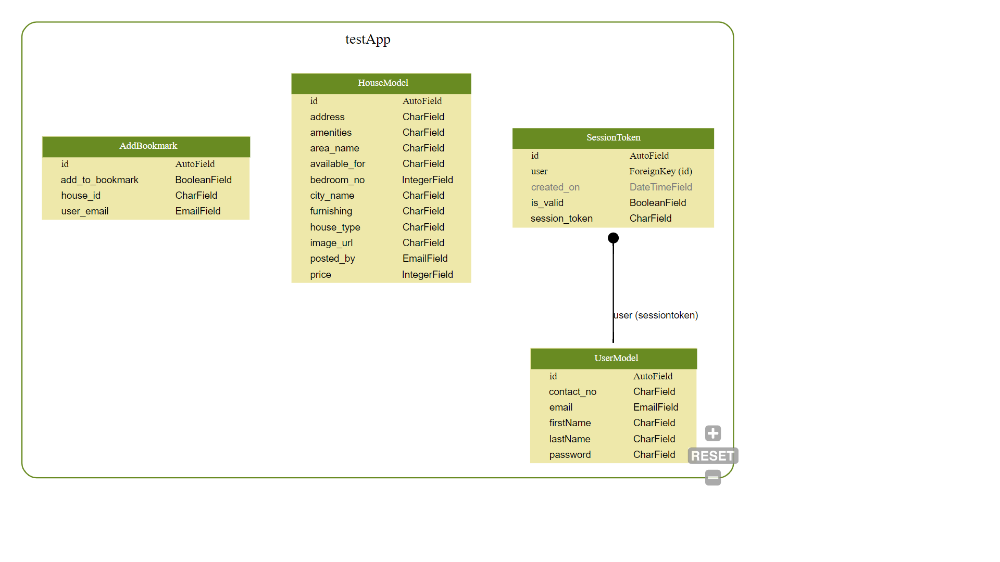

# djangothon
django extensions for model schema and CSRF


# Django upper
1. `CODE GENERATION` : In django rest if developer create a model then for CRUD opertion developer need to write lots of repetitive code for serializers and generic api views. This code will automatically generate the required code for each model of app.
Run following command in same directory of models.py-
` python generate.py `
2. `CSRF_REFERER_CHECK`: Created a new csrf middleware which allows request to pass without checking referer check. Currently django rejects the requests without referer header. However, some users may prevent their browsers from sending the Referer header, due to privacy concerns. These users are unable to submit 'non-safe' requests (e.g. POST requests) on HTTPS-enabled Django-powered website that use CSRF protection.

Clone this app to your django project and add following in the settings.py :

```

MIDDLEWARE_CLASSES = [
    ...
    'djangoupper.middleware.newcsrf.CsrfViewMiddleware',
    ...
]

INSTALLED_APPS = [
    ...
    'djangoupper',
]

# csrf referer check in user request
CSRF_REFERER_CHECK=True

```
3. `Model_Graph_UI`: Created a UI system to show the real time updations, deletions and referencing of django models. A Graph diagram image has been created to facilitate developers to see and verify the model schema.




